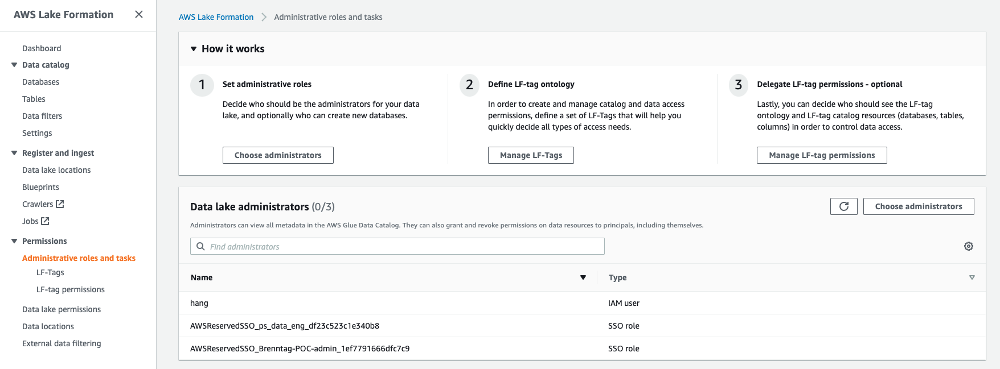
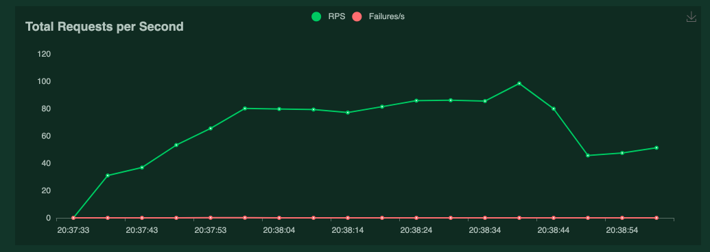
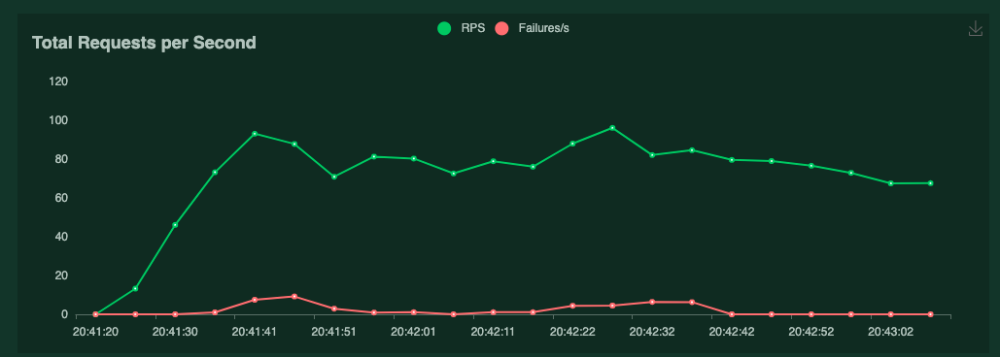

# THA Data Engineer

[Assignment detail](https://datachef.notion.site/THA-Data-Engineer-72092166008c4b4d94f48a4e7a9acd9c)

<br/>
<br/>

## 1. Assumptions
- For a specific quarter, `campaign_id` and `banner_id` combination is unique.
- For a specific quarter, `click_id` is unique.
- For a specific quarter, `conversion_id` is unique.
- File upload also has to correspond to a specific quarter

<br/>
<br/>

## 2. Architecture and Design Rationale

At minimum, the app must include Data Storage and a Backend to process and serve requests. Since processing a request involves aggregating history data to return the correct result, and all of our data are well-structured, I decided to use AWS Redshift as a Data warehouse.

Intuitively, we don't want to over-query the RDBMS by running a query that aggregates all-time data for every request. A table called `revenues` contains aggregated data is generated, and now the backend only needs to query this table for a request to `campaigns/<campaign_id>`. The combination (`campaign_id`, `banner_id`, `quarter`) forms the Primary Key of this table.

```
CREATE TABLE revenues(
    campaign_id INT NOT NULL,
    banner_id INT NOT NULL,
    quarter INT NOT NULL,
    revenue FLOAT NOT NULL,             -- Sum of revenues
    number_of_clicks INT NOT NULL       -- Count of clicks
);
```

With this new table, access to the original data tables (`impressions`, `clicks`, `conversions`) is no longer necessary. We only need those tables when there is new data and we need to recompute the aggregations for `revenues`. Thus, I decide to store those tables in S3 to minimize cost of Redshift which is much more. Redshift provides a functionality called **Redshift Spectrum** to directly query data files from S3. This is convenient in this case since we don't have to `COPY` (an expensive operation) the data back to Redshift in case we need any aggregations. Furthermore, pushing data files to S3 is many folds faster than `INSERT` to any database.

There are 2 main functionalities the app needs to support: getting a `banner_id` from a `campaign_id` based on certain conditions (read) and loading new data (write). The first requirement is easily met with a single query to the `revenues` table. This is true with the assumption that `revenues` table is kept in synch with new written data. 

One thing that I aim for is to put as much processing of data to Redshift as possible, Redshift transparently communicates with S3, hence avoiding pulling data from S3 or Redshift.

<br/>

### 2.1 S3 as Permanent Storage
A S3 bucket is used to store all data files (`impressions`, `clicks`, `conversions`) and banner images. Banner images are publicly accessible without authorization. 

In terms of data files, Redshift Spectrum can query directly CSV files. However, this is not as efficient as a columnar, compressed file format. I used **Parquet** (_snappy_ compressed) as data file format, it offers a great compression rate compared to raw CSV (can be half or 1/4 in size). It's columnar which is convenient and efficient for some functionalities (detailed later).

<br/>

### 2.2 Redshift as Data Warehouse
In this case, Redshift acts as the main backend database, accessing S3 when needed. Redshift only stores 1 **internal** table `revenues`. Other data tables are all external, accessible through the *Spectrum*. Besides these, Redshift is equipped with 3 Stored Procedures leveraged when new data arrives for _WRITE_ (detailed later).

<br/>

### 2.3 Lightsail Container Service for Web App
Flask is containerized into a Docker Image and deployed to Lightsail for hosting. It's easy and simple enough for this use case.

<br/>
<br/>

## 3. Functionality Analysis

The analysis will focus on precheck, deduplication and the _WRITE_ functionality of new data files. As mentioned above, _read_ is easily achieved with correct _WRITE_.

<br/>

### 3.1 Precheck and Deduplication of new Data Files
Prior to deduplication, a data file is checked for schema conformity. If it passes, it's then cleansed from inner duplicates and non-defined values.

```
"""
# Table Schemas
schemas = {
    "impressions": {
        "banner_id" : np.int64,
        "campaign_id" : np.int64
    },
    "clicks": {
        "click_id" : np.int64,
        "banner_id" : np.int64,
        "campaign_id" : np.int64
    },
    "conversions": {
        "conversion_id" : np.int64,
        "click_id" : np.int64,
        "revenue" : np.float64
    }
}
...
Preprocess DataFrame: Drop duplicate rows, Drop NA
"""
def preprocess_csv_file(df: pd.DataFrame, table: str) -> pd.DataFrame:
    # Preliminary Schema check
    expected_schema = pd.Series(schemas[table])
    if not expected_schema.equals(df.dtypes):
        return None

    df.drop_duplicates(inplace= True)
    df.dropna(inplace= True)

    return df
```
_web/src/backend.py_

Deduplication involves 2 criteria: file name and file content. An uploaded file with the same name as any previous files will not be accepted regardless of its contents. This is achieved by looking through the names of data files stored in S3. This is 1 pro point for using Redshift Spectrum setup where data files are on S3. For content deduplication, based on assumptions mentioned in the previous section, we need to get stored data to compare with new, to-write data. This is where parquet data files come in. Since parquet files are columnar, Spectrum is able to read only necessary columns instead of whole files. 

For instance, for `conversions` table, we only need `conversion_id` column to filter duplicate rows in the new `conversions` file and for just 1 specific `quarter` (parquet files are also partitioned based on `quarter`). Roughly only 1/4 of 1 column out of 4 columns is accessed, huge save since Spectrum is priced based on amount of data scanned.

```
"""
Deduplicate the DataFrame based on contents of remote table
"""
def deduplicate_content(df: pd.DataFrame, table: str, quarter: str)-> pd.DataFrame:
    # Deduplication based on file content
    if table == "impressions":
        query_cols = ["banner_id", "campaign_id"]
    elif table == "clicks":
        query_cols = ["click_id"]
    elif table == "conversions":
        query_cols = ["conversion_id"]
    ...
    query = f"""
        SELECT {",".join(query_cols)} FROM ext_tha_schema.{table} WHERE quarter = {quarter}
    """
    cursor.execute(query)
    remote_df = pd.DataFrame(cursor.fetchall(), columns=query_cols)
    ...
    # if there's no data in the remote table
    if remote_df.empty:
        return df
    
    filter_na_col = "filter"
    # Create new column, will later be used for filter
    remote_df[filter_na_col] = True
    joined_df = pd.merge(df, remote_df, how='left', on=query_cols)

    # Filter non-na
    # keep rows whose filter_na_col is 'na' in joined dataframe
    # if not 'na', old data already has those rows
    joined_df = joined_df[pd.isna(joined_df[filter_na_col])].drop(filter_na_col, axis=1)
    ...
```
_web/src/backend.py_

<br/>


### 3.2 WRITE of new Data Files
In return for a simple _READ_ operation (1 internal table is involved, with only filter and no aggregations), the _WRITE_ procedure is long-winded. The procedure is as follows:

- After deduplications, new data is uploaded to a `staging` folder as compressed parquet file.
- A new `EXTERNAL` table is created, pointing to this `staging` folder,
```
def synch_with_internal_table(df: pd.DataFrame, table: str, quarter: int, file_name: str)-> None:
    ...
    create_temp_table_query = f"""
        CREATE EXTERNAL TABLE ext_tha_schema.{staging_table_name}(
            {get_column_definition(table)}
        )
        STORED AS PARQUET
        LOCATION '{staging_parquet_folder}';
    """
    cursor.execute(create_temp_table_query)
    ...
```
_web/src/backend.py_

To avoid collision with other staging tables, the name is formed `staging_table_name = f"{table}_{epoch_now}"`

- This new `EXTERNAL` table is then processed by a stored procedure (provisioned in Redshift during bootstrapping). Based on the type (`impressions`, `clicks` or `conversions`), there is a separate, somewhat similar to each other, stored procedure for each. Exact implementation of these procedures can be found at `init_data/db/bootstrap_sql.py_` with names `public.synch_new_impressions`, `public.synch_new_clicks` and `public.synch_new_conversions` and will be discussed below.

- Once the stored procedure finished, the newly created `EXTERNAL` table is dropped. Its parquet in S3 is moved from `staging` folder to the permanent storage folder with other data files according to its `table` and quarter`. 

```
"""
Sequence of steps to synch new data with internal table 'tha.public.revenues'.
"""
def synch_with_internal_table(df: pd.DataFrame, table: str, quarter: int, file_name: str)-> None:
    ...
    # Upload to permanent address
    permanent_parquet_url = f"{bucket_url}/{table}/quarter={quarter}/{file_name}.parquet.snappy"
    df.to_parquet(permanent_parquet_url, engine= "pyarrow",compression="snappy", index=False)

    # Remove staging table
    cursor.execute(f"DROP TABLE IF EXISTS ext_tha_schema.{staging_table_name};")

    connection_pool.putconn(conn)

    # Remove staging file
    folder_prefix = staging_parquet_folder.split(bucket_url)[1][1:]
    bucket.objects.filter(Prefix=folder_prefix).delete()
    ...
```
_web/src/backend.py_

<br/>

### 3.3 _Synch_ Stored Procedures' Implementations
Making sure the synchronization and aggregation of new data with old aggregated data go correctly is important. 

```
**Note**
It's worth noting that when new data arrive, that new data corresponds to 1 specific table (`impressions`, `clicks`, `conversions`) and 1 specific quarter. Despite this, the outcome of adding several data files will remain the same regardless of the order they are added.
```

```    
    CREATE OR REPLACE PROCEDURE public.synch_new_impressions(ext_table character varying(256), quarter character varying(1))
    LANGUAGE plpgsql
    AS $$
    BEGIN

        DROP TABLE IF EXISTS temp;
        
        -- Create and Populate Temp View
        -- Temp View aggregates data from staging table and current 'revenues'
        EXECUTE(
        'CREATE TEMP TABLE temp AS '
        +  '( '
        +    'SELECT '
        +      'campaign_id, '
        +      'banner_id, '
        +      'quarter, '
        +      'SUM(revenue) AS revenue, '
        +      'SUM(number_of_clicks) AS number_of_clicks '
        +    'FROM ' 
        +    '( '
        +      'SELECT '
        +        'impressions.campaign_id AS campaign_id, '
        +        'impressions.banner_id AS banner_id, '
        +        quarter || ' AS quarter, '
        +        'CASE '
        +            'WHEN SUM(conversions.revenue) IS NOT NULL THEN SUM(conversions.revenue) '
        +            'ELSE 0 '
        +        'END AS revenue, '
        +        'CASE '
        +            'WHEN COUNT(clicks.click_id) IS NOT NULL THEN COUNT(clicks.click_id) '
        +            'ELSE 0 '
        +        'END AS number_of_clicks '
        +      'FROM ( '
        +        'SELECT * FROM ' || ext_table
        +      ') AS impressions '
        +      'LEFT JOIN '
        +        '( '
        +          'SELECT * FROM ext_tha_schema.clicks WHERE quarter= ' || quarter
        +        ') AS clicks '
        +      'ON impressions.banner_id = clicks.banner_id '
        +         'AND impressions.campaign_id = clicks.campaign_id '
        +      'LEFT JOIN '
        +        '( '
        +          'SELECT * FROM ext_tha_schema.conversions WHERE quarter= ' || quarter
        +        ') AS conversions '
        +      'ON clicks.click_id = conversions.click_id '
        +      'GROUP BY impressions.campaign_id, impressions.banner_id '
        +      'UNION ALL '
        +      'SELECT * FROM revenues '
        +    ') '
        +    'GROUP BY campaign_id, banner_id, quarter '
        +  '); '
        );
        
        -- Replace revenues with temp
        TRUNCATE TABLE revenues;

        INSERT INTO revenues SELECT * FROM temp;
        
        DROP TABLE temp;
    END;
    $$;
```
*init_data/db/bootstrap_sql.py*

Essentially, the procedure creates a temporary table, populate it with `UNION ALL` of the current `revenues` and aggregation between new data and old data (`ext_tha_schema.clicks`,`ext_tha_schema.clicks` and `ext_tha_schema.clicks`). It later aggregates the temp table to preserve Primary key constraint for (`campaign_id`, `banner_id`, `quarter`) and replace the current `revenues` table with this temp table contents.

Depending on the type of new `EXTERNAL` table, the types of the `JOIN`'s and aggregation rules will slightly differ. The `JOIN` condition (`ON`) stays the same. In general,

```
new_impressions LEFT JOIN old_clicks LEFT JOIN old_conversions

old_impressions INNER JOIN new_clicks LEFT JOIN old_conversions

old_impressions INNER JOIN old_clicks INNER JOIN new_conversions
```

There are other differences I will leave out.

**This part is heavily and manually tested.

<br />
<br />

## 4. Deployment
Prerequisites: 
- Enough AWS Permissions for your account to create `Role`, `User`, `Policy`, `Policy Attachment`, `Glue Catalog Database`, `Redshift cluster`,...
- As a separate resource, you need to be `Data Lake Administrator` for AWS Lake Formation of the region. This should be done from the portal as shown below.


 
 
- Configured AWS CLI (valid `~/.aws/` directory) and a running Docker service. All steps below will use your AWS CLI credentials.

Deployment is done in 2 steps, both in a Docker container to ensure everything needed is available (Python, AWS CLI, Lightsailctl, Terraform).

<br/>

### 4.1 Infra Deployment
At project root directory, run:
```
docker build . -f Dockerfile-infra-deployment -t tha-infra-deployment && \
docker run --rm -v ~/.aws:/root/.aws -v $PWD/web:/app/web -v $PWD/init_data:/app/init_data -v $PWD/infra:/app/infra tha-infra-deployment
```
This step consists of 2 phases. 

The first phase reads Terraform configurations in `infra/` and creates all necessary AWS resources. Their states are recorded under `infra/terraform.tfstate` file. After this phase finishes, you can actively manage the resources with Terraform from outside the container. Make sure you have Terraform version 1.0.4 (same as that of the image), then you can update the AWS resources' configurations and run normal Terraform workflow (`terraform plan` and `terraform apply`). 

Some variables that can be changed before running this deployment phase are defined in `infra/terraform.tfvars`.

After all AWS resources are deployed, 3 configurations files are created and copied to the necessary directories in the project.

```
flask_configs.json                  # Configurations consumed by Flask App. E.g: Redshift host, port, username, password, S3 bucket for stored data,...
credentials                         # Credentials of IAM User that the data_setup.py script will use to authenticate to deploy initial data
data_setup_configs.json             # Configurations consumed by the data_setup.py script
```

With the necessary configurations, the second loads the previously created S3 buckets with initial data (provided CSV files), banner images and create all Redshift tables, external tables, stored procedures,... 

<br/>

### 4.2 Web App Deployment
With the infra and initial data ready, we can deploy the Flask App to serve the website. 
At project root directory, run:
```
docker build . -f Dockerfile-web-deployment -t tha-web-deployment && \
docker run --rm -v ~/.aws:/root/.aws -v $PWD/web:/app/web -v /var/run/docker.sock:/var/run/docker.sock tha-web-deployment
```
The Flask app is deployed onto AWS Lightsail Container Service, a simple service to host web application. However, the downside is that it's not supported by Terraform yet and I decided to just deploy it using AWS CLI (with lightsailctl plugin). Again the commands to deploy the service is run inside a container.

To deploy to Lightsail Container Service, the web app Docker image needs to be built first and published to Lightsail. Since we already need to run AWS CLI commands inside a container, I want to build the Docker image of the Flask app inside the container as well. Otherwise, this step will need to be split into 2 separate steps. To achieve this, the docker socket is mounted as a volume to the container `-v /var/run/docker.sock:/var/run/docker.sock`, and inside the image, `docker` client is installed. This way the docker client in the container will use the docker daemon from host (local machine) to build the Flask image which is then pushed and run from Lightsail.

Configuring size, service name and instance count is done in `deploy-web.sh` file. `SERVICE_NAME` should be in synch between `deploy-web.sh` and `clean.sh` files.

<br/>

### 4.3 Deployment Clean Up
Another Image is provided to clean up everything starting with the Web app on Lightsail service and then all AWS resources (with Terraform).
At project root directory, run:
```
docker build . -f Dockerfile-clean -t tha-clean && \
docker run --rm -v ~/.aws:/root/.aws -v $PWD/infra:/app/infra tha-clean
```

<br/>

### 4.4 Fine grained control
The web app and infrastructure can be managed separately. The web app is managed by running AWS CLI (with lightsailctl plugin) and infrastructure with Terraform configurations under `infra`.

<br/>
<br/>

## 5. Stress Testing
Script:
```
class StressTest(HttpUser):
    wait_time = between(60,70)

    @task
    def get_banner(self):
        i = randint(1,50)
        self.client.get(f"/campaigns/{i}")
```
*web/locustfile.py*

Stress tests are run against these specs:
```
Redshift:
    node_type   = "ra3.xlplus"
    node_count  = "node-count"

Lightsail Container Service:
    power = small
    scale = 5
```



No errors for 5000 requests over 1 minute

<br/>



About 4% error rate for 10000 requests over 1 minute

Details can be found under `stress_test_results`.

It appears the performance is mostly dependent on Redshift scale and not much on Lightsail. This observation aligns with implementation intentions where I put most computation needs to Redshift.

<br/>
<br/>

## 6. Improvements
- Code is not tested. Partly because I don't have time, partly because it's kind of hard to test SQL queries, which accounts for a big amount of logic
- CI/CD pipeline, not enough time, can be quite easily incorporated since deployments are dockerized

<br/>
<br/>

## 7. Reflections

For this assignment, the approach I took to use Redshift and Spectrum is quite overkill. A traditional RDBMS like MySQL or Postgres on AWS RDS would perform better on the same budget compared to Redshift since there are about only 80000 rows in the aggregated `revenues` table. However, the first approach offers a huge potential for scaling. When it comes to millions of rows, Redshift easily outshines RDS, plus data can be partly stored in S3 without compromising performance.
